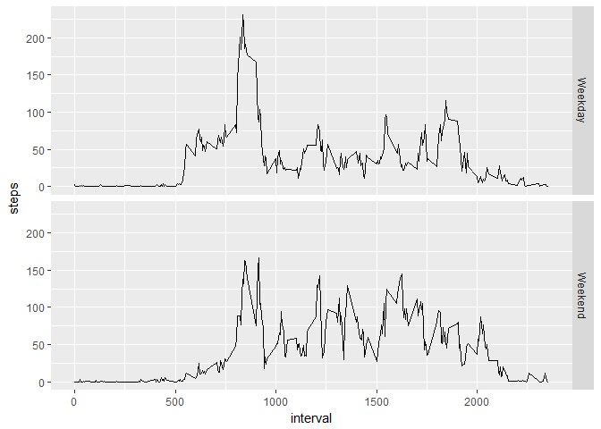

# Reproducible Research: Peer Assessment 1

## Loading the required packages

```r
library(dplyr)
```

```
## 
## Attaching package: 'dplyr'
```

```
## The following objects are masked from 'package:stats':
## 
##     filter, lag
```

```
## The following objects are masked from 'package:base':
## 
##     intersect, setdiff, setequal, union
```

```r
library(ggplot2)
```

## Loading and preprocessing the data
1. Load the data

```r
unzip("activity.zip")
activity <- read.csv("activity.csv")
```
2. Process/transform the data

```r
activitycomplete <- na.omit(activity)
```


## What is mean total number of steps taken per day?
1. Calculate the total number of steps taken per day
I use the dplyr library to collpase the data by day, creating the sum of steps

```r
activityday <- group_by(activitycomplete, date)
activityday <- summarize(activityday, steps = sum(steps))
```

2. Histogram of the total number of steps taken each day
I am using the qplot() function from the ggplot2 package

```r
qplot(steps, data = activityday)
```

```
## `stat_bin()` using `bins = 30`. Pick better value with `binwidth`.
```

<!-- -->

3. Calculate and report the mean and median of the total number of steps taken per day

```r
mean(activityday$steps)
```

```
## [1] 10766.19
```

```r
median(activityday$steps)
```

```
## [1] 10765
```

## What is the average daily activity pattern?
1. Make a time series plot of the 5-minute interval (x-axis) and the average number of steps taken, averaged across all days (y-axis)

Creating a data frame in which steps are aggregated into averages within each 5 minute interval

```r
activityinterval <- group_by(activitycomplete, interval)
activityinterval <- summarize(activityinterval, steps = mean(steps))
```
Plot the average daily steps against the intervals

```r
ggplot(activityinterval, aes(interval, steps)) + geom_line()
```

<!-- -->

2. Which 5-minute interval, on average across all the days in the dataset, contains the maximum number of steps?

```r
activityinterval[activityinterval$steps == max(activityinterval$steps), ]
```

```
## # A tibble: 1 × 2
##   interval    steps
##      <int>    <dbl>
## 1      835 206.1698
```
## Imputing missing values
*Note that there are a number of days/intervals where there are missing values (coded as NA). The presence of missing days may introduce bias into some calculations or summaries of the data.*
1. Calculate and report the total number of missing values in the dataset (i.e. the total number of rows with `NA`s)

```r
nrow(activity) - nrow(activitycomplete)
```

```
## [1] 2304
```

2. Devise a strategy for filling in all of the missing values in the dataset. The strategy does not need to be sophisticated. For example, you could use the mean/median for that day, or the mean for that 5-minute interval, etc.

I am replacing missing values with the mean number of steps for each interval across all of the days.

```r
names(activityinterval)[2] <- "mean.steps"
activityimpute <- merge(activity, activityinterval)
```

3. Create a new dataset that is equal to the original dataset but with the missing data filled in.

**If steps is NA, I am replacing the value with the mean number of steps for the interval**

```r
activityimpute$steps[is.na(activityimpute$steps)] <- activityimpute$mean.steps[is.na(activityimpute$steps)]
```

4. Make a histogram of the total number of steps taken each day and Calculate and report the mean and median total number of steps taken per day. Do these values differ from the estimates from the first part of the assignment? What is the impact of imputing missing data on the estimates of the total daily number of steps?

Create a dataset with the total number of steps per day using the imputed data

```r
activitydayimpute <- group_by(activityimpute, date)
activitydayimpute <- summarize(activitydayimpute, steps = sum(steps))
```
Generate histogram

```r
qplot(steps, data = activitydayimpute)
```

```
## `stat_bin()` using `bins = 30`. Pick better value with `binwidth`.
```

<!-- -->

Calculate mean and median

```r
mean(activitydayimpute$steps)
```

```
## [1] 10766.19
```

```r
median(activitydayimpute$steps)
```

```
## [1] 10766.19
```
The mean appears to be unaffected by this simple data imputation. The median is smaller.

## Are there differences in activity patterns between weekdays and weekends?
For this part the `weekdays()` function may be of some help
1. Create a new factor variable in the dataset with two levels - "weekday" and "weekend" indicating whether a given date is a weekday or weekend day.

```r
activityimpute$dayofweek <- weekdays(as.Date(activityimpute$date))
activityimpute$weekend <- as.factor(activityimpute$dayofweek == "Saturday" | activityimpute$dayofweek == "Sunday")
levels(activityimpute$weekend) <- c("Weekday", "Weekend")
```

2. Make a panel plot containing a time series plot of the 5-minute interval (x-axis) and the average number of steps taken, averaged across all weekday days or weekend days (y-axis).
Summarize the mean steps into two different data frames

```r
activityimpute <- group_by(activityimpute, interval)
activityweekday <- summarize(filter(activityimpute, weekend == "Weekday"), steps = mean(steps))
activityweekday$weekend <- "Weekday"
activityweekend <- summarize(filter(activityimpute, weekend == "Weekend"), steps = mean(steps))
activityweekend$weekend <- "Weekend"
```
Append the two data frames together and create a time series

```r
activityinterval <- rbind(activityweekend, activityweekday)
activityinterval$weekend <- as.factor(activityinterval$weekend)
ggplot(activityinterval, aes(interval, steps)) + geom_line() + facet_grid(weekend ~ .)
```

<!-- -->
